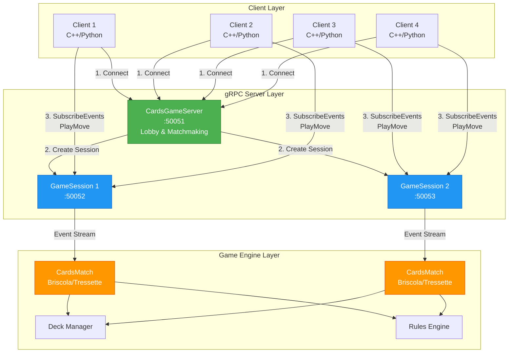
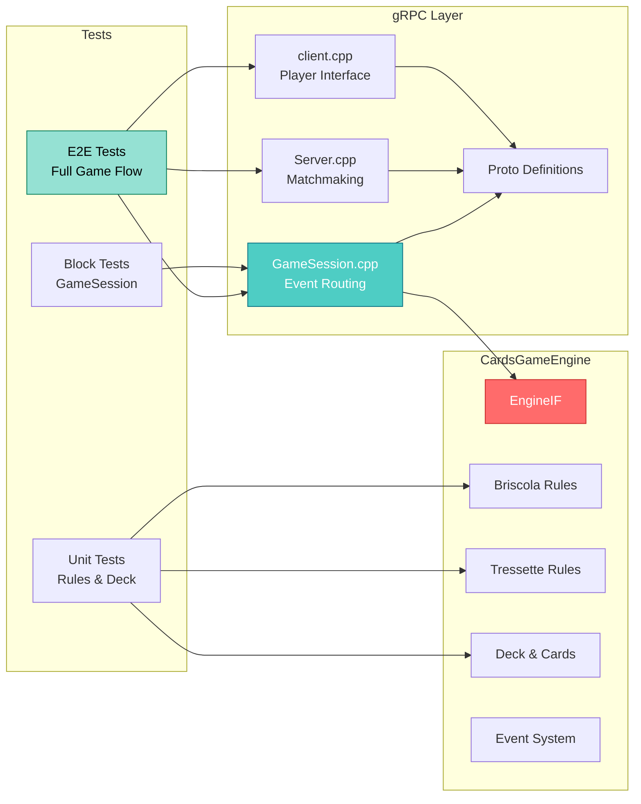
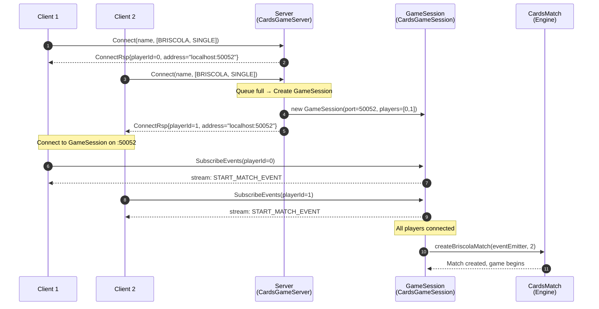
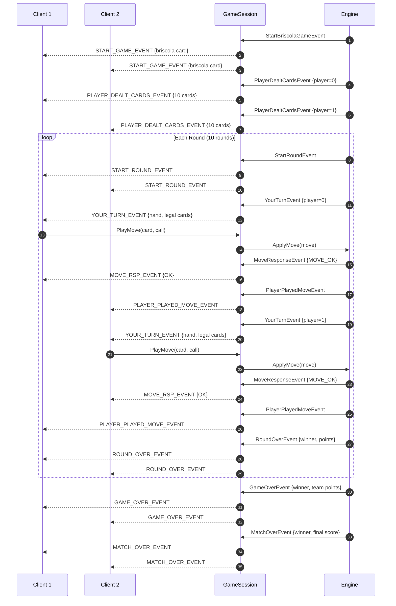

# 🃏 CardsGame Engine + gRPC Server

A high-performance, multiplayer Italian card game server supporting **Briscola** and **Tressette** with AI opponents. Built with C++20, gRPC, and a clean event-driven architecture.

[](https://github.com/VjeranCvitanic/CardsGameApp/actions)

---

## 🎮 Supported Games

| Game | Players | Modes | Special Features |
|------|---------|-------|------------------|
| **Briscola** | 2 or 4 | Single/Teams | Last round teammate reveal |
| **Tressette** | 4 | Teams | Acussos (bonus points), visible dealt cards |

---

## 🏗️ Architecture Overview



### Component Breakdown



---

## 🔄 Connection & Game Flow

### 1️⃣ Connection Sequence



### 2️⃣ Game Flow (Briscola 2-Player)



---

## 📡 Event Routing Table

| Event Type | Visibility | Recipients |
|------------|-----------|------------|
| `START_MATCH_EVENT` | Broadcast (personalized) | All players |
| `START_GAME_EVENT` | Broadcast | All players |
| `START_ROUND_EVENT` | Broadcast | All players |
| `PLAYER_DEALT_CARDS_EVENT` (Briscola) | Private | Owner only |
| `PLAYER_DEALT_CARDS_EVENT` (Tressette) | Broadcast | All **except** owner |
| `YOUR_TURN_EVENT` | Private | Active player only |
| `MOVE_RSP_EVENT` | Private | Moving player only |
| `PLAYER_PLAYED_MOVE_EVENT` | Broadcast | All **except** mover |
| `ROUND_OVER_EVENT` | Broadcast | All players |
| `GAME_OVER_EVENT` | Broadcast | All players |
| `MATCH_OVER_EVENT` | Broadcast | All players |
| `ACUSSO_EVENT` (Tressette) | Broadcast | All **except** owner |
| `BRISCOLA_LAST_ROUND_EVENT` | Team-private | Teammate only |

---

## 🚀 Quick Start

### Prerequisites

| Platform | Requirements |
|----------|-------------|
| **macOS** | CMake ≥ 3.16, Homebrew, C++20 compiler |
| **Windows** | CMake ≥ 3.16, Visual Studio 2022, vcpkg |

### Installation

#### macOS (Homebrew)

```bash
# Install dependencies
brew install cmake protobuf grpc

# Configure & build
cmake -S . -B build
cmake --build build

# Run server
./build/gRPC/server

# Run client (in another terminal)
./build/gRPC/client Alice briscola 2 human
```

#### Windows (vcpkg)

```powershell
# Install dependencies (x64 Native Tools prompt)
vcpkg install grpc protobuf --triplet x64-windows

# Configure
cmake -S . -B build -G "Visual Studio 17 2022" `
  -DCMAKE_TOOLCHAIN_FILE=$env:VCPKG_ROOT\scripts\buildsystems\vcpkg.cmake `
  -DVCPKG_TARGET_TRIPLET=x64-windows

# Build
cmake --build build --config Release

# Run server
.\build\gRPC\Release\server.exe

# Run client (in another terminal)
.\build\gRPC\Release\client.exe Alice briscola 2 human
```

---

## 🎯 Client Usage

```bash
client <name> <game_type> <num_players> <ai|human>
```

### Examples

```bash
# 2-player Briscola with human input
./build/gRPC/client Alice briscola 2 human

# 4-player Tressette with AI
./build/gRPC/client Bob tressette 4 ai

# 2-player Briscola with AI
./build/gRPC/client Charlie briscola 2 ai
```

### Game Input Format

When it's your turn, enter moves as:
```
<card_number> <card_color> [call]
```

**Examples:**
- `1 1` - Play Asso di Spade
- `10 2 1` - Play Re di Coppe with BUSSO call
- `7 4` - Play Sette di Bastoni

**Card Numbers:** 1=Asso, 2=Due, ..., 8=Fante, 9=Cavallo, 10=Re  
**Card Colors:** 1=Spade, 2=Coppe, 3=Denari, 4=Bastoni  
**Calls (Tressette):** 1=BUSSO, 2=STRISCIO, 3=CON_QUESTA_BASTA

---

## 🧪 Testing

```bash
# Build tests
cmake -S tests -B tests/build
cmake --build tests/build

# Run all tests
cd tests/build && ctest --output-on-failure

# Run specific test suites
./tests/build/unit/test_briscola_rules
./tests/build/unit/test_tressette_rules
./tests/build/block/test_game_session_events
```

### Test Coverage

- **Unit Tests:** Deck management, card rules, game logic
- **Block Tests:** GameSession event handling
- **E2E Tests:** Full game flow with Python client

---

## 📂 Project Structure

```
CardsGameApp/
├── CardsGameEngine/          # Core game engine (C++20)
│   ├── inc/
│   │   ├── EngineBase/       # Base classes & interfaces
│   │   ├── Briscola/         # Briscola-specific rules
│   │   ├── Events/           # Event system
│   │   └── EngineIF.h        # Engine interface
│   └── src/                  # Implementation files
│
├── gRPC/                     # gRPC server & client (C++17)
│   ├── inc/
│   │   ├── Server.h          # Lobby & matchmaking
│   │   ├── GameSession.h     # Game session management
│   │   └── client.h          # Client interface
│   ├── src/
│   └── proto/
│       └── cardsGame.proto   # Protocol definitions
│
├── tests/
│   ├── unit/                 # Unit tests (GoogleTest)
│   ├── block/                # Integration tests
│   └── e2e/                  # End-to-end tests (Python)
│
├── doc/
│   ├── sequence_diagram.md   # Detailed sequence diagrams
│   └── client_guide.md       # Client development guide
│
└── .github/workflows/
    └── cross-platform-build.yml  # CI/CD pipeline
```

---

## 🛠️ Development

### Creating a Custom Client

See [`doc/client_guide.md`](doc/client_guide.md) for detailed instructions on implementing clients in C++ or Python.

**Key Steps:**
1. Generate gRPC stubs from `gRPC/proto/cardsGame.proto`
2. Implement `Connect()` to join lobby
3. Implement `SubscribeEvents()` to receive game events
4. Implement `PlayMove()` to send player actions

### Adding New Game Types

1. Extend `CardsGameEngine/inc/EngineBase/`
2. Implement game-specific rules
3. Update `cardsGame.proto` with new message types
4. Add event handlers in `GameSession`

---

## 🎨 Features

- ✅ **Multi-platform:** macOS, Windows, Linux
- ✅ **Event-driven architecture:** Clean separation of concerns
- ✅ **AI opponents:** Built-in AI for testing and single-player
- ✅ **Type-safe:** Protocol Buffers + C++20
- ✅ **Concurrent sessions:** Multiple games running simultaneously
- ✅ **Comprehensive testing:** Unit, integration, and E2E tests
- ✅ **CI/CD:** Automated cross-platform builds

---

## 🤝 Contributing

Contributions welcome! Please:
1. Fork the repository
2. Create a feature branch
3. Add tests for new functionality
4. Ensure all tests pass
5. Submit a pull request

---

## 📄 License

This project is available for educational and personal use.

---

## 📞 Support

For detailed sequence diagrams and protocol documentation, see:
- [`doc/sequence_diagram.md`](doc/sequence_diagram.md) - Complete event flow diagrams
- [`doc/client_guide.md`](doc/client_guide.md) - Client implementation guide
- [`gRPC/proto/cardsGame.proto`](gRPC/proto/cardsGame.proto) - Protocol definitions

---

<div align="center">

**Built with ❤️ using C++20, gRPC, and Protocol Buffers**

[Report Bug](https://github.com/VjeranCvitanic/CardsGameApp/issues) · [Request Feature](https://github.com/VjeranCvitanic/CardsGameApp/issues)

</div>
