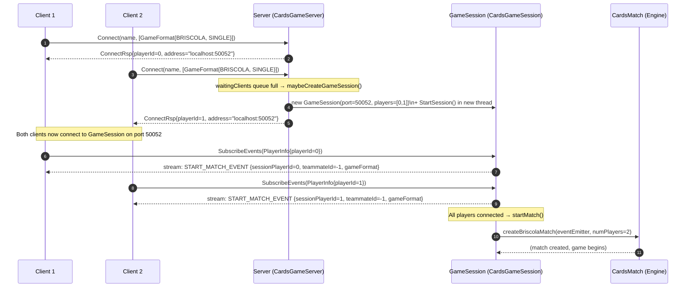
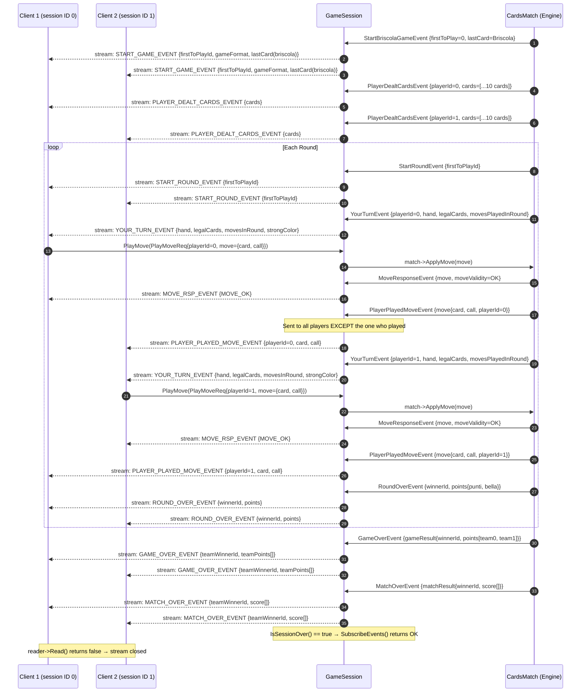
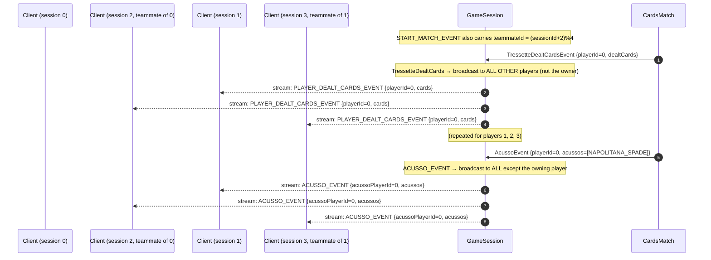
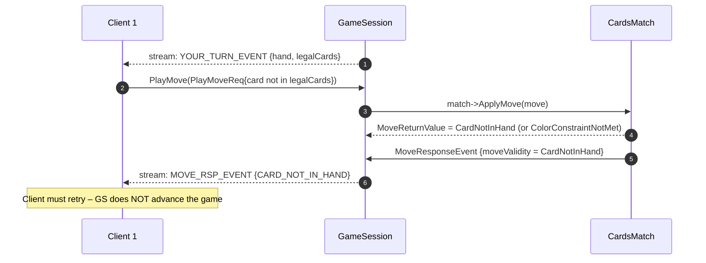
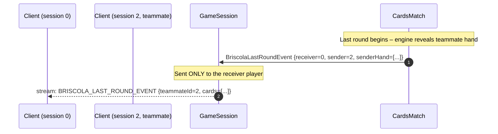

# CardsGame – Client ↔ Server ↔ GameSession Sequence Diagrams

Rendered with [Mermaid](https://mermaid.js.org/).  
Open in any Mermaid-aware viewer (VS Code extension, GitHub, mermaid.live).

---

## 1. Connection & Session Setup

---

## 2. Game Flow – Event Stream (Briscola 2-player, single round)

> Events emitted by the Engine are received by `GameSession` via `EventSink::onEvent()`,
> translated to proto messages, and forwarded over each player's `SubscribeEvents` stream.

---

## 3. Tressette-specific extras (4-player / MULTI)

---

## 4. Invalid Move Handling

---

## 5. Briscola 4-player – Last Round teammate hand reveal

---

## 6. Routing Summary

| Event | Visibility | Who receives it |
|---|---|---|
| `START_MATCH_EVENT` | Broadcast (on subscribe) | Each player (personalised) |
| `START_GAME_EVENT` | Broadcast | All players |
| `START_ROUND_EVENT` | Broadcast | All players |
| `PLAYER_DEALT_CARDS_EVENT` (Briscola) | Private | Owner only |
| `PLAYER_DEALT_CARDS_EVENT` (Tressette) | Broadcast | All **except** owner |
| `YOUR_TURN_EVENT` | Private | Active player only |
| `MOVE_RSP_EVENT` | Private | Moving player only |
| `PLAYER_PLAYED_MOVE_EVENT` | Broadcast | All **except** mover |
| `ROUND_OVER_EVENT` | Broadcast | All players |
| `GAME_OVER_EVENT` | Broadcast | All players |
| `MATCH_OVER_EVENT` | Broadcast | All players |
| `ACUSSO_EVENT` | Broadcast | All **except** owner |
| `BRISCOLA_LAST_ROUND_EVENT` | Team (Private) | Receiver only |
